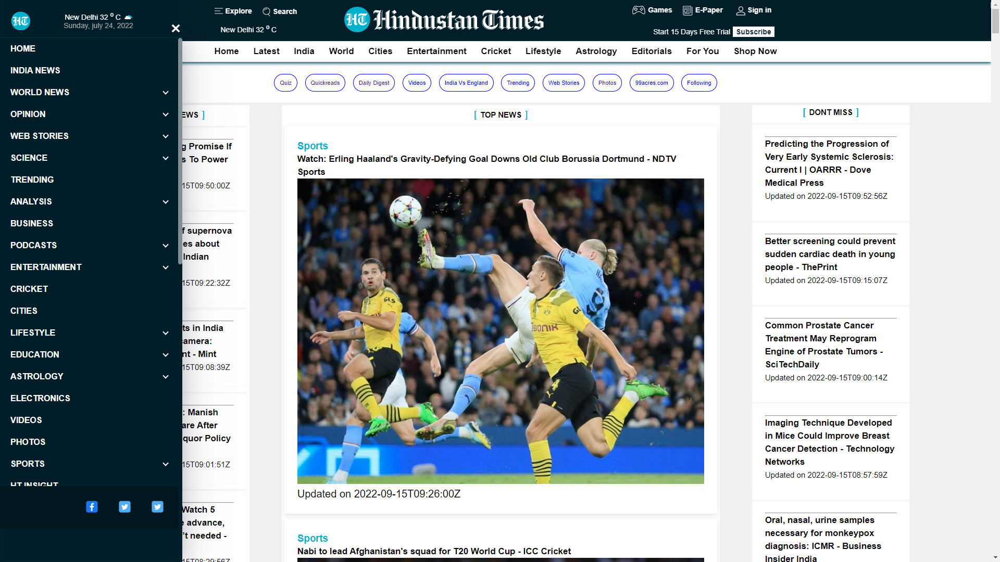
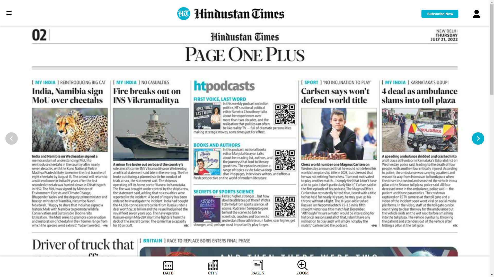
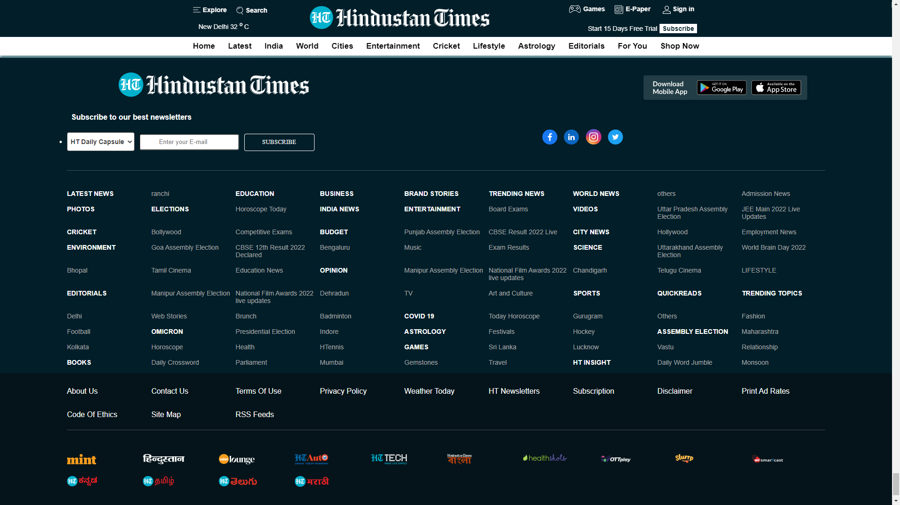

# Hindustan Times - Clone

* Hindustan Times is an Indian English-language daily newspaper website.

* We have cloned This website in five Days.


## Environment Variables

To run this project, you will need to add the following environment variables to your file

`API_KEY`


## Features

- Signup/Login
- Latest news
- Fullscreen mode only


## Tech Stack

* JavaScript
* HTML/CSS 
* APIs
## 🔗 Links
[](https://KeshavCh0udhary.github.io/)

[](https://shalini2909.github.io/)

[](https://github.com/Pankaj-78278/)

[](https://github.com/aakarshpatel84/)


## Screenshots









## Usage/Examples

```javascript
// We can inport multiple functions using this...
import {fun1,fun2,fun..,funN} from 'FolderName'

document.querySelector(".className").innerHTML = fum1();
document.querySelector("#Idname").innerHTML = fum2();

//etc..
```

Using this we can use same code multiple times.
## Lessons Learned

We learned how to fetch APIs and build a good website using it.


## Support

For support, email krishna2000chy@gmail.com .


## Applogies

It might be possible that you will not see the News due to API Policy.

